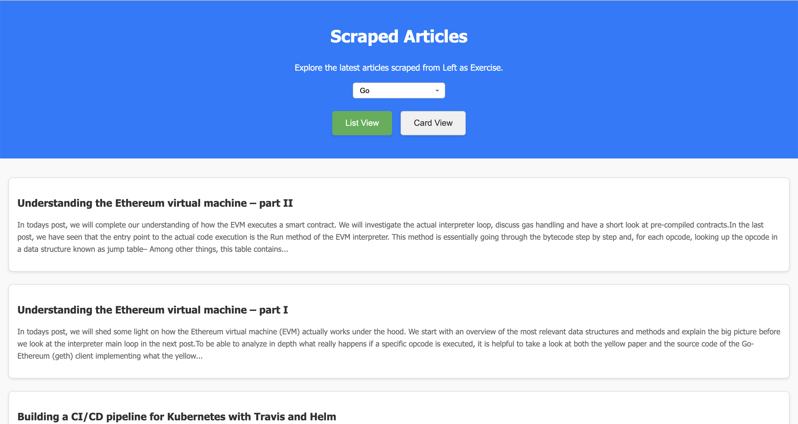
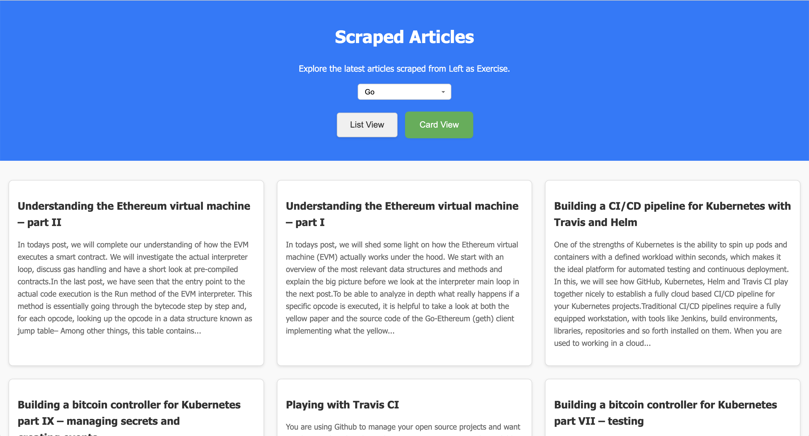

# Web Scraper with Dynamic Article Display

A **Go-based web scraping** project that extracts articles from a static website and dynamically displays them using **HTMX** for seamless updates. The project includes options to toggle between **list** and **card** views and supports pagination and category filtering.

## 🌟 Features

- 📝 **Scrape articles** from static websites and display them dynamically.
- 🔄 **HTMX-powered** interactions for smooth content loading without full page refresh.
- 🗂️ Toggle between **List View** and **Card View** with a stylish UI.
- 📄 **Pagination** for navigating articles page by page.
- 🏷️ **Category Filtering** to filter articles by specific categories.
- 🎨 **Responsive Design** that adapts to various screen sizes (mobile, tablet, desktop).

## 🚀 Technologies Used

- **Go** (Backend & Scraper)
- **Colly** (Web Scraping Library)
- **HTMX** (Dynamic Content Loading)
- **CSS** (Responsive & Stylish UI)
- **HTML** (Frontend Markup)

## 📸 Screenshots

| **List View**                           | **Card View**                           |
|-----------------------------------------|-----------------------------------------|
|  |  |

## 🛠️ Setup Instructions

### 1. Prerequisites

Ensure you have Go installed on your machine. You can download it from [here](https://golang.org/dl/).

### 2. Clone the Repository

```bash
git clone https://github.com/mortum5/scraper.git
cd scraper
```

### 3. Install Dependencies

Use go mod to install the required dependencies for this project, including Colly.

```bash
go mod tidy
```

### 4. Run the Application

Start the server by running:

```bash
go run main.go
```

By default, the server will run on `http://localhost:8080`.

### 5. Access the Web Application

Open your browser and navigate to:

```bash
http://localhost:8080
```

## 🖥️ Usage

- **Pagination**: Navigate through different pages of articles using the Next and Previous buttons.
- **View Toggle**: Switch between List and Card view by clicking the respective buttons.
- **Category Filter**: Select categories from the dropdown to filter articles.

### Example Workflow:

1. **Toggle Views**: Use the "List View" and "Card View" buttons to toggle between article layouts.
2. **Pagination**: Browse through different pages of articles using the pagination controls.
3. **Category Filter**: Filter articles by categories using the dropdown menu in the header.

## ⚙️ Configuration

You can configure the scraping source URL and other parameters by editing the `main.go` file.

### Example Config:

```go
const (
    baseURL = "https://leftasexercise.com/page/"
    port    = ":8080"
)
```

## 🎨 Customization

To customize the styles or UI behavior, modify the `style.css` and `index.html` files located in the `static/` directory.

### Customize the Colors:

```css
.toggle-button.active {
    background-color: #4CAF50;
    color: white;
}
```

### Customize Grid Layout:

```css
#articles-list.card-view {
    grid-template-columns: repeat(3, 1fr);
}
```

## 🤝 Contributing

Contributions, issues, and feature requests are welcome! Feel free to check the [issues](https://github.com/mortum5/scraper/issues) page.

## 📝 License

This project is licensed under the MIT License - see the [LICENSE](LICENSE) file for details.

Made with 💻 by [Andrei Gonchar](https://github.com/mortum5)
